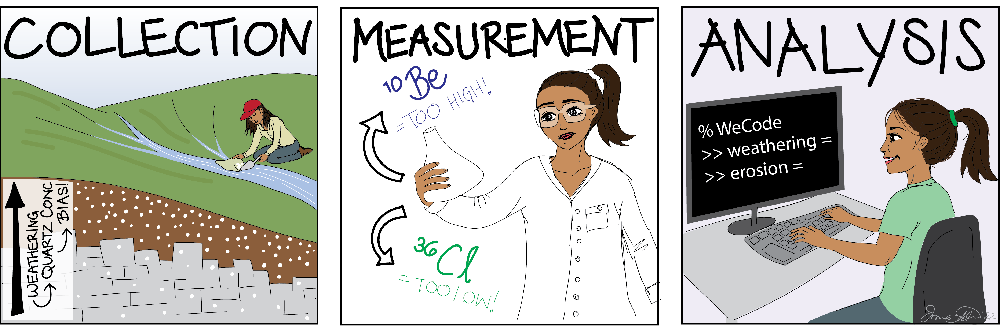

# WeCode - Weathering Corrections for denudation rates

This repository contains functions to calculate denudation rates in landscapes where
minerals with different solubilities are present. All necessary functions are in the
subroutines folder. The repository also contains example scripts on how to use the
supplied functions (except the Cronus package, which can be downloaded here 
https://bitbucket.org/cronusearth/cronus-calc/src/v2.1/). 
In particular, the codes calculate denudation rates for landscapes where cosmogenic 
nuclides were measured and weathering is non negligible. I have adopted the code package
for 10Be measurements on an insoluble target mineral (e.q., quartz) AND/OR 36Cl 
measurements on a soluble target mineral (e.g., calcite). 

The codes are based on Riebe and Granger (2013) equation 14 and Ott et al.(2022)
Cronus Calc v2.1 is used for the calculation of production rates and needs to be in the 
Matlab search path. If you want to run the code with alluvial basin data, you also need 
TopoToolbox in your Matlab search path. The code will then compute average nuclide production
rates for your basin in a pixel-by-pixel approach. The code also provides a set of modified
Cronus Calc v2.1 functions to achieve this.

## Which files to fill in and run
Example input files are provided for all scripts, including test data that you can use to
run the code. 
Single nuclide measurement with an independent weathering rate:
Test_Input_Single_Be.xlsx -> 10Be, Test_Input_Single_Cl.xlsx -> 36Cl
Test_input_Paired.xlsx is for running the paired nuclide optimization

## Different modes for denudation calculation 

* PairedCRN_denudation:
Assuming you have a paired 10Be and 36Cl measurement and know your bedrock OR regolith chemistry 
(fraction of quartz, fraction of calcite, fraction of other insoluble minerals), you 
can calculate the "real denudation rate". The code uses an optimization algorithm to solve 
for the correct denudation rate and enrichment/depletion of minerals in the soil.
The code also estimates the weathering rate based on the given parameters. Use the 
Test_input_Paired.xlsx excel sheet to adjust input parameters.

* SingleCRN_denudation: This code calculates the "real" denudation rate from a
single nuclide measurement (soluble or insoluble target mineral), given that either the 
bedrock or soil chemistry is provided (for 36Cl only), and the overall weathering rate is known.
It uses a built-in optimization algorithm to find the denudation rate.

* Soil_Bedrock_weathering: This script calculates denudation rates for cases where weathering
concentrates along the regolith-bedrock interface. To solve the equations it uses a the fminsearch
Matlab optimization algorithm. Run this script with one of the single nuclide test files.

* CarbBias: This script plots the bias in denudation rate measurements due to
enrichment/depletion of minerals for different soil depths. 

* SLHL_bias_plots: Run this script to recreate figures 3,5, and 7 in Ott et. al 2022.

## Important!
If you want to use the CDF (chemical depletion fraction) input, switch to the CDF branch of the repository

## References
Cite as:
Ott, Richard (2022): WeCode - Weathering Corrections for denudation rates. V. 1.0. GFZ Data Services.
https://doi.org/10.5880/GFZ.4.6.2022.001

Related references:
Crameri, F. (2018), Scientific colour-maps, Zenodo, doi:10.5281/zenodo.1243862

Marrero, S. M., Phillips, F. M., Borchers, B., Lifton, N., Aumer, R., & Balco, G. (2016). 
Cosmogenic nuclide systematics and the CRONUScalc program. Quaternary Geochronology, 31, 160–187. 
https://doi.org/10.1016/j.quageo.2015.09.005
